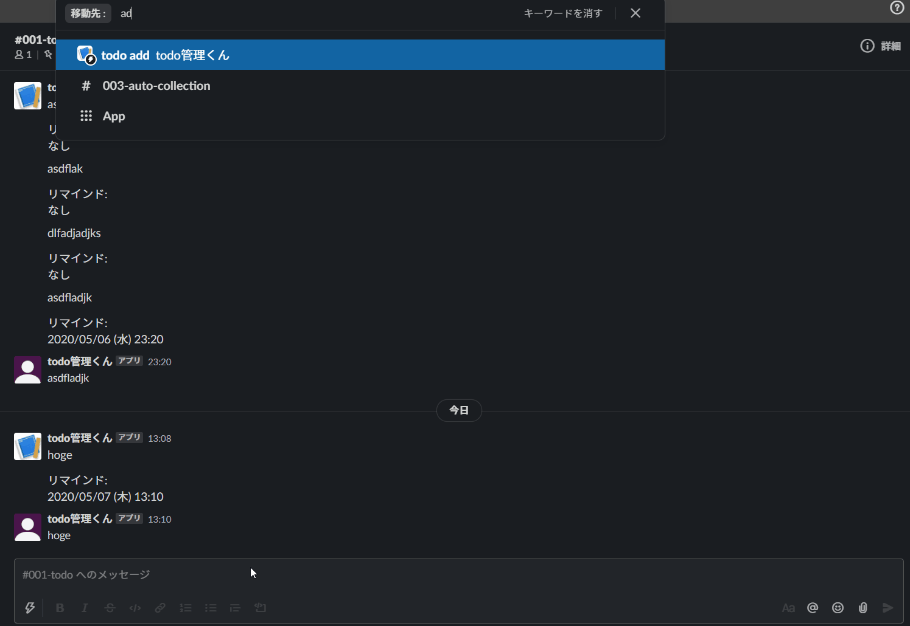

# MR.todo (todo管理くん)
GAS(Google Apps Script)を使った todo を管理してくれる 自作 Slack App  
<!-- TODO: できれば英語でも書く   -->  

## Description
GAS を使い、スプレッドシートで todo を管理します。  
Slack App としてSlackから入力を受け付けたり、通知をします。  

***DEMO:***  
  

## Features
<!-- - Awesome function -->  

<!-- For more information, see `awesome-tool help`. -->  

## Requirement
<!-- - Requirement -->  

## Usage
<!-- 1. Usage -->  

## Installation
<!-- ```sh                                              -->  
<!-- $ git clone https://github.com/eetann/awesome-tool -->  
<!-- ```                                                -->  

<!-- ## Anything Else -->  

## Author
[@eetann092](https://twitter.com/eetann092)  

<!-- ## License                           -->  
<!-- [MIT](http://eetann.mit-license.org) -->  
